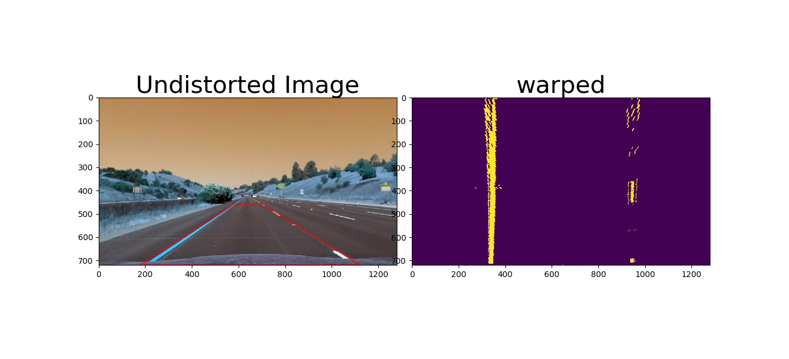
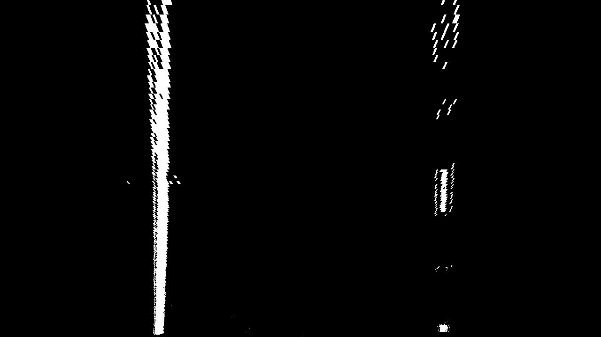
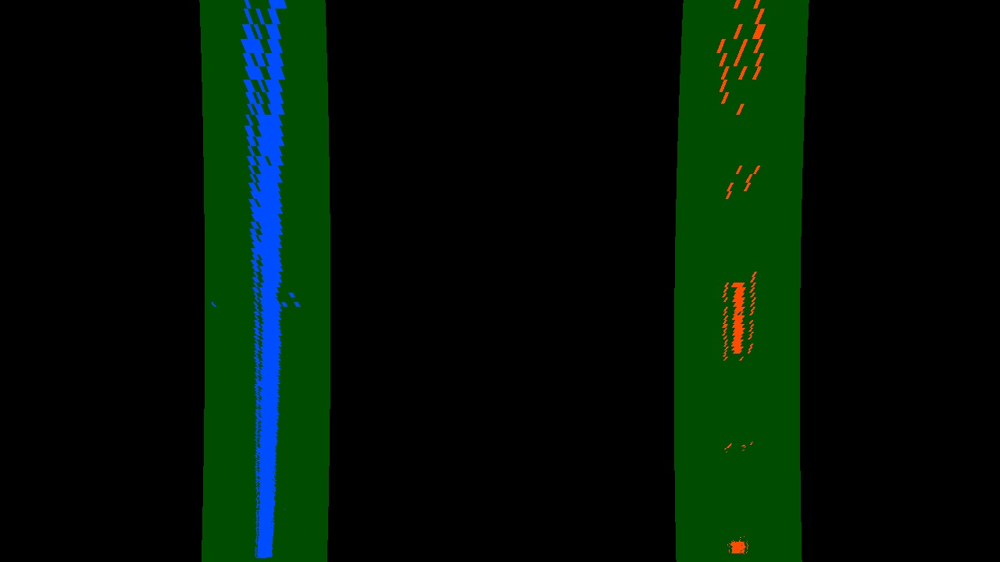
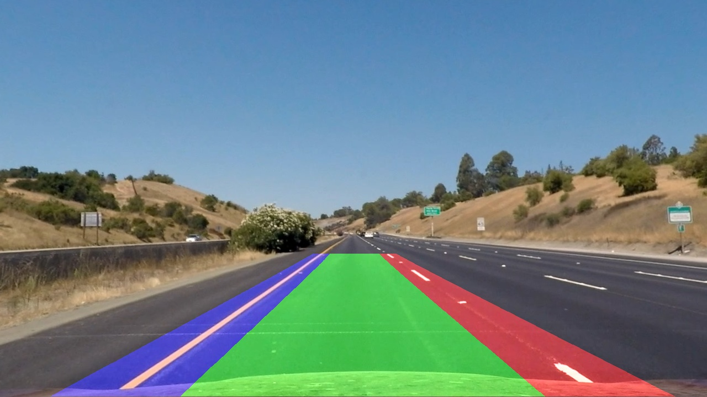
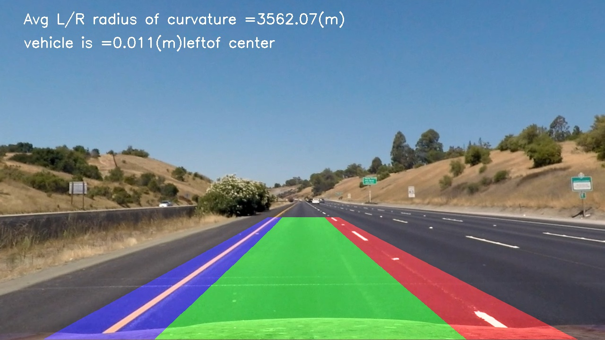

## Writeup Template

### You can use this file as a template for your writeup if you want to submit it as a markdown file, but feel free to use some other method and submit a pdf if you prefer.

---

**Advanced Lane Finding Project**

The goals / steps of this project are the following:

* Compute the camera calibration matrix and distortion coefficients given a set of chessboard images.
* Apply a distortion correction to raw images.
* Use color transforms, gradients, etc., to create a thresholded binary image.
* Apply a perspective transform to rectify binary image ("birds-eye view").
* Detect lane pixels and fit to find the lane boundary.
* Determine the curvature of the lane and vehicle position with respect to center.
* Warp the detected lane boundaries back onto the original image.
* Output visual display of the lane boundaries and numerical estimation of lane curvature and vehicle position.

[//]: # (Image References)

[image1]: ./examples/undistort_output.png "Undistorted"
[image2]: ./test_images/test1.jpg "Road Transformed"
[image3]: ./examples/binary_combo_example.jpg "Binary Example"
[image4]: ./examples/warped_straight_lines.jpg "Warp Example"
[image5]: ./examples/color_fit_lines.jpg "Fit Visual"
[image6]: ./examples/example_output.jpg "Output"
[video1]: ./project_video.mp4 "Video"

## [Rubric](https://review.udacity.com/#!/rubrics/571/view) Points

### Here I will consider the rubric points individually and describe how I addressed each point in my implementation.  

---

### Writeup / README

#### 1. Provide a Writeup / README that includes all the rubric points and how you addressed each one.  You can submit your writeup as markdown or pdf.  [Here](https://github.com/udacity/CarND-Advanced-Lane-Lines/blob/master/writeup_template.md) is a template writeup for this project you can use as a guide and a starting point.  

### Camera Calibration

#### 1. Briefly state how you computed the camera matrix and distortion coefficients. Provide an example of a distortion corrected calibration image.

The code for this step is contained in lines #12 through #51 of the file called `Project.py`).  

I start by preparing "object points", which will be the (x, y, z) coordinates of the chessboard corners in the world. Here I am assuming the chessboard is fixed on the (x, y) plane at z=0, such that the object points are the same for each calibration image.  Thus, `objp` is just a replicated array of coordinates, and `objpoints` will be appended with a copy of it every time I successfully detect all chessboard corners in a test image.  `imgpoints` will be appended with the (x, y) pixel position of each of the corners in the image plane with each successful chessboard detection. An example of the output of corner detection:


I then used the output `objpoints` and `imgpoints` to compute the camera calibration and distortion coefficients using the `cv2.calibrateCamera()` function and saved the camera calibration coefficients in a dictionary called "calibration.p" using pickle line #54 to #57 of the same file. I applied distortion correction to the test image using the `cv2.undistort()` function and obtained this result:
the undistorsion effect can be seen on the right chessboard image.


### Pipeline (single images)

#### 1. Provide an example of a distortion-corrected image.

To demonstrate this step, I will describe how I apply the distortion correction to one of the test images like this one (code line #61 to #73):
The effect on undistorsion can be seen on the right image, the changes at the back of the white car and on the front side of the testing car.


#### 2. Describe how (and identify where in your code) you used color transforms, gradients or other methods to create a thresholded binary image.  Provide an example of a binary image result.

Please refer to file `Project_B.py` for this section. I tried different combinations and finaly decided to use Sobel in x and y orientation as descirbed in the function `abs_sobel_thresh()`, code line #23 to #41. And then converted the image to HLS color space to extract the S binary channel and converted to HSV to extract the V binary channel as mentioned in the function ColorPipeline, code line #45 to #76. I then combined Sobel x and y along with S and V binary channels to output the "preprocessImg" as explained in the line code from #303 to #308.  Here's an example of my output for this step.


#### 3. Describe how (and identify where in your code) you performed a perspective transform and provide an example of a transformed image.

The code for my perspective transform includes a function called `corners_unwarp(img, src, dst)`, which appears in lines 13 through 21 in the file `Project_B.py`.  The `corners_unwarp()` function takes as inputs an image (`img`), as well as source (`src`) and destination (`dst`) points.  I chose to hardcode the source and destination points in the following manner (code line 312 to 322):

```python
    src = np.float32([[578, 460], [180, 720], [1127, 720], [703, 460]])
    dst = np.float32([[320, 0], [320, 720], [960, 720], [960, 0]])
    warped, Minv = corners_unwarp(preprocessImg, src, dst)

```
 

I verified that my perspective transform was working as expected in all test images by drawing the `src` and `dst` points onto a test image and its warped counterpart to verify that the lines appear parallel in the warped image.





#### 4. Describe how (and identify where in your code) you identified lane-line pixels and fit their positions with a polynomial?

Please refer to function `find_lane_pixels()` from line #80 to #159 of file `Project_B.py`.

After applying calibration, thresholding, and a perspective transform, I plotted the histogram by summing over the half of the bianry activations across the image vertically to identify the maximum number of pixels corresponding to the left and right lanes. An example of histogram from the warped image of test1:


The function then identifies 9 windows from which to identify lane pixels, each one centered on the midpoint of the pixels from the window below. This effectively "follows" the lane lines up to the top of the binary image, and speeds processing by only searching for activated pixels over a small portion of the image. Pixels belonging to each lane line are identified as left and right x and y points. And the function `fit_polynomial()` (line #161) uses the extracted left and right pixel positions to fit a second order polynomial using Numpy polyfit() method. 

The image below demonstrates the window sliding image and the polynomial fit to the x and y points.




#### 5. Describe how (and identify where in your code) you calculated the radius of curvature of the lane and the position of the vehicle with respect to center.

The radius of curvature equation is used from the lecture notes based on `https://www.intmath.com/applications-differentiation/8-radius-curvature.php`. In the file code `Project_B.py` I used the function `measure_curvature_real()` (line #271 to #297) by providing the left and right curve fits from the function `fit_polynomial()` to calculate the true value of the radius of curvature in meters for left_curverad and right_curverad.

The function is called in line #351 and the position of vehicle with respect to center is measure from line #367 to #372.

#### 6. Provide an example image of your result plotted back down onto the road such that the lane area is identified clearly.

I implemented this step in lines #359 through #364 in my code in `Project_B.py` using the inverse transpose Minv from th previous function `corners_unwarp()`.  Here is an example of my result on a test image:





---

### Pipeline (video)

#### 1. Provide a link to your final video output.  Your pipeline should perform reasonably well on the entire project video (wobbly lines are ok but no catastrophic failures that would cause the car to drive off the road!).

`video._clip.py` is a copy of my `Project_B.py` code, with the addition of video clip and html python libraries import. I put the lines #300 to #376 from `Project_B.py` as a function called `image_process()`  in `video._clip.py` with the result output being the the detected lane boundaries back onto the original image (line #346).
I then used the following commands to generate the video clip:

```python
output_video = 'video.mp4'
input_video = 'project_video.mp4'

clip1 = VideoFileClip(input_video)
video_clip = clip1.fl_image(image_process)
video_clip.write_videofile(output_video, audio = False)
```

Here's a [link to my video result](./video.mp4)

---

### Discussion

#### 1. Briefly discuss any problems / issues you faced in your implementation of this project.  Where will your pipeline likely fail?  What could you do to make it more robust?

I spent a lot of time identifying the best source and destination points for perspective transform. The CV2 perspective transform method is very sensitive to src and dst input values. There is still room to better fine tune the color pipeline and perhaps the src and dst that would perfectly fit the lanes in different shade and curve conditions, however it requires much more time. So I decided to chose the current numbers.

Second improvement, I would use a Class to store all those variables that I had to declare using different functions as input into other functions. So in that case these variables would be reusable in my entire code. I found the utility of using Classes in this project where there is a lot of functions envolved. So this is something that I would spend more time for improvement if I had to pursue the project further.

